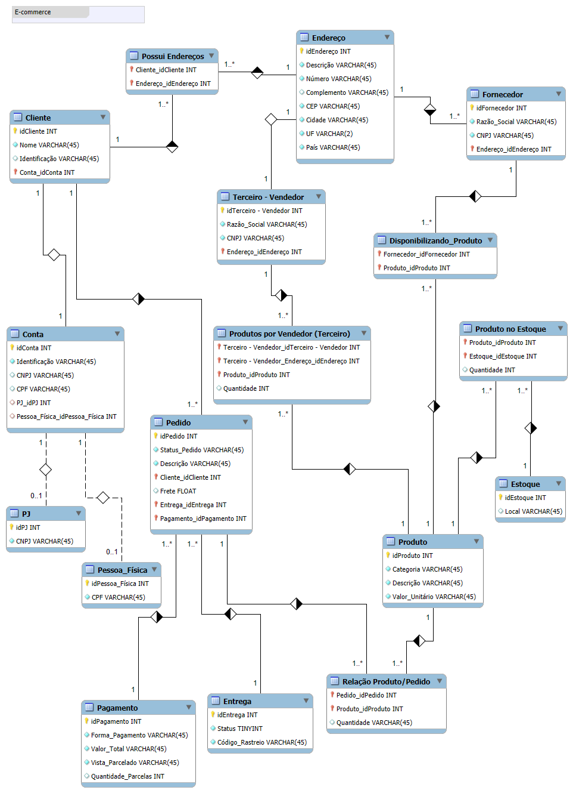

# 🛒 **Design do Banco de Dados de E-commerce: A Arquitetura Por Trás do Sucesso**

Este repositório apresenta o **Diagrama de Entidade-Relacionamento (DER)** que sustenta a base de um e-commerce moderno e eficiente. Projetado com o **MySQL Workbench**, o banco de dados é robusto, escalável e otimizado para operações diárias de alto desempenho. 🚀

 

## 🌟 **Sobre o Projeto**
Este trabalho foi desenvolvido como parte do curso **"Refinando um Projeto Conceitual de Banco de Dados – E-COMMERCE"**, ministrado por [Juliana Mascarenhas](https://www.linkedin.com/in/juliana-mascarenhas-ds/), no **Bootcamp da [Suzano](https://www.linkedin.com/company/suzano/posts/?feedView=all) - Análise de Dados com Power BI**, em parceria com a [DIO](https://www.dio.me/).  

Aqui, o objetivo é criar um modelo de dados que atenda às demandas de um e-commerce em constante crescimento, garantindo eficiência, integridade e escalabilidade.

 

## 📈 Visualização do Diagrama

   

 

## 🧱 **Entidades e Atributos**

### **1. Cliente:**  
🧍 Pessoa que realiza compras na plataforma.
- **Atributos:**  
  - `idCliente (INT, PK)` – Identificador único do cliente.  
  - `Nome (VARCHAR(45))` – Nome completo do cliente.  
  - `Identificação (VARCHAR(45))` – Nome de usuário ou identificação adicional.  
  - `idConta (INT, FK)` – Referência à conta do cliente.

---

### **2. Conta:**  
💼 Centraliza informações financeiras e de acesso do cliente.
- **Atributos:**  
  - `idConta (INT, PK)` – Identificador único da conta.  
  - `Identificação (VARCHAR(45))` – Informações específicas da conta (ex: nome de usuário).  
  - `idPJ (INT, FK)` – Referência à pessoa jurídica, se aplicável.  
  - `idPessoa_Fisica (INT, FK)` – Referência à pessoa física, se aplicável.

---

### **3. Pessoa Jurídica (PJ):**  
🏢 Dados da empresa cliente.
- **Atributos:**  
  - `idPJ (INT, PK)` – Identificador único da pessoa jurídica.  
  - `CNPJ (VARCHAR(45))` – Cadastro Nacional da Pessoa Jurídica.  

---

### **4. Pessoa Física:**  
🧑 Dados do cliente pessoa física.
- **Atributos:**  
  - `idPessoa_Física (INT, PK)` – Identificador único da pessoa física.  
  - `CPF (VARCHAR(45))` – Cadastro de Pessoa Física.  

---

### **5. Endereço:**  
🏠 Dados de localização.
- **Atributos:**  
  - `idEndereço (INT, PK)` – Identificador único do endereço.  
  - `Descrição (VARCHAR(45))` – Endereço completo.  
  - `Número (VARCHAR(45))` – Número do imóvel.  
  - `Complemento (VARCHAR(45))` – Detalhes adicionais, como apartamento.  
  - `CEP (VARCHAR(45))` – Código postal.  
  - `Cidade (VARCHAR(45))` – Cidade.  
  - `UF (VARCHAR(2))` – Estado.  
  - `País (VARCHAR(45))` – País.

---

### **6. Produto:**  
📦 Item disponível para venda.
- **Atributos:**  
  - `idProduto (INT, PK)` – Identificador único do produto.  
  - `Categoria (VARCHAR(45))` – Categoria do produto.
  - `Descrição (VARCHAR(45))` – Descrição do produto.
  - `Valor_Unitário (VARCHAR(45))` – Preço unitário.

---

### **7. Fornecedor:**  
📜 Empresa que fornece produtos para a plataforma.
- **Atributos:**  
  - `idFornecedor (INT, PK)` – Identificador único do fornecedor.  
  - `Razão_Social (VARCHAR(45))` – Nome do fornecedor.  
  - `CNPJ (VARCHAR(45))` – CNPJ do fornecedor.
  - `idEndereço (INT, FK)` – Referência ao endereço do fornecedor.

---

### **8. Estoque:**  
📊 Quantidade de produtos disponíveis em um local específico.
- **Atributos:**  
  - `idEstoque (INT, PK)` – Identificador único do estoque.  
  - `Local (VARCHAR(45))` – Localização do estoque.  

---

### **9. Pedido:**  
🛍️ Registro de uma compra realizada.
- **Atributos:**  
  - `idPedido (INT, PK)` – Identificador único do pedido.  
  - `Status_Pedido (VARCHAR(45))` – Status do pedido (ex: aguardando pagamento, em processamento, enviado, entregue).
  - `Descrição (VARCHAR(45))` – Descrição do pedido (opcional).
  - `idCliente (INT, FK)` – Referência ao cliente que fez o pedido.
  - `Frete (FLOAT)` – Valor do frete.
  - `idEntrega (INT, FK)` – Referência à entrega do pedido.
  - `idPagamento (INT, FK)` – Referência ao pagamento do pedido.

---

### **10. Pagamento:**  
💳 Detalhes do pagamento realizado.
- **Atributos:**  
  - `idPagamento (INT, PK)` – Identificador único do pagamento.  
  - `Forma_Pagamento (VARCHAR(45))` – Método utilizado (ex: cartão de crédito, boleto bancário).  
  - `Valor_Total (VARCHAR(45))` – Valor total do pagamento.  
  - `Vista_Parcelado (VARCHAR(45))` – Forma de pagamento (vista ou parcelado).
  - `Quantidade_Parcelas (INT)` – Quantidade de parcelas, se aplicável.

---

### **11. Entrega:**  
🚚 Informações sobre a entrega do pedido.
- **Atributos:**  
  - `idEntrega (INT, PK)` – Identificador único da entrega.  
  - `Status (TINYINT)` – Status da entrega (ex: 1-Aguardando envio, 2-Em trânsito, 3-Entregue).  
  - `Código_Rastreio (VARCHAR(45))` – Código de rastreio.

---

### **12. Terceiro - Vendedor:**
🧑‍💼 Terceiro que vende produtos na plataforma.
- **Atributos:**
  - `idTerceiro_Vendedor (INT, PK)` - Identificador único do terceiro vendedor.
  - `Razão_Social (VARCHAR(45))` - Razão social do terceiro vendedor.
  - `CNPJ (VARCHAR(45))` - CNPJ do terceiro vendedor.
  - `idEndereço (INT, FK)` - Referência ao endereço do terceiro vendedor.

---

### **13. Produtos por Vendedor (Terceiro):**
📊 Relaciona produtos com terceiros vendedores.
- **Atributos:**
  - `idTerceiro_Vendedor (INT, FK)` - Referência ao terceiro vendedor.
  - `idProduto (INT, FK)` - Referência ao produto.
  - `Quantidade (INT)` - Quantidade de produtos disponíveis para venda.

---

### **14. Disponibilizando_Produto:**
🔄 Define quais fornecedores disponibilizam cada produto.
- **Atributos:**
  - `idFornecedor (INT, FK)` - Referência ao fornecedor.
  - `idProduto (INT, FK)` - Referência ao produto.

---

### **15. Produto no Estoque:**
📦 Quantidade de um produto em um estoque específico.
- **Atributos:**
  - `idProduto (INT, FK)` - Referência ao produto.
  - `idEstoque (INT, FK)` - Referência ao estoque.
  - `Quantidade (INT)` - Quantidade do produto em estoque.

---

### **16. Relação Produto/Pedido:**
🛒 Detalhes dos produtos em cada pedido.
- **Atributos:**
  - `idPedido (INT, FK)` - Referência ao pedido.
  - `idProduto (INT, FK)` - Referência ao produto.
  - `Quantidade (INT)` - Quantidade do produto no pedido.

 

## 🔗 **Relacionamentos**

- **Cliente - Conta:** Um cliente pode ter uma conta associada.
- **Conta - Pessoa Jurídica/Física:** Uma conta pode ser de uma empresa ou de um indivíduo.
- **Cliente - Pedido:** Um cliente pode realizar vários pedidos.
- **Pedido - Pagamento:** Cada pedido possui um pagamento associado.
- **Pedido - Entrega:** Cada pedido possui uma entrega relacionada.
- **Fornecedor - Produto:** Um fornecedor pode oferecer vários produtos.
- **Produto - Estoque:** Cada produto possui um controle no estoque.
- **Endereço - Cliente:** Um cliente pode ter vários endereços cadastrados.
- **Endereço - Fornecedor:** Um fornecedor pode ter um endereço cadastrado.
- **Terceiro - Vendedor - Produtos por Vendedor (Terceiro):** Um terceiro vendedor pode ter vários produtos.
- **Fornecedor - Disponibilizando_Produto:** Um fornecedor disponibiliza vários produtos.
- **Produto - Disponibilizando_Produto:** Um produto pode ser disponibilizado por vários fornecedores.
- **Produto - Produto no Estoque:** Um produto pode estar em vários estoques.
- **Estoque - Produto no Estoque:** Um estoque pode conter vários produtos.
- **Produto - Relação Produto/Pedido:** Um produto pode estar em vários pedidos.
- **Pedido - Relação Produto/Pedido:** Um pedido pode conter vários produtos.

 

## 🚀 **Por que Isso Importa?**
O modelo garante:  
- **📊 Integridade dos Dados:** Mantendo informações consistentes e precisas.  
- **📈 Escalabilidade:** Preparado para o crescimento do mercado.  
- **🔧 Manutenibilidade:** Estrutura flexível para ajustes e melhorias.  
- **⚡ Eficiência:** Operações otimizadas para alta performance.

 

## 💻 **Tecnologia Utilizada**
- **MySQL Workbench:** Ferramenta usada para modelagem e visualização do banco de dados.

 

## 🛠️ **Como Usar**
1. Utilize o DER como referência para criar scripts SQL.  
2. Implemente o banco de dados para suportar aplicações de e-commerce.  
3. Expanda ou ajuste conforme as necessidades do negócio.

 

## 👨‍💻 Expert

    
    
&nbsp&nbsp&nbspMarcos Winther 
    &nbsp&nbsp&nbsp
    <a href="https://github.com/MarcosWinther">
    GitHub</a>&nbsp;|&nbsp;
    <a href="https://www.linkedin.com/in/marcoswinthersilva/">LinkedIn</a>
    

  

---

⌨️ com 💜 por [Marcos Winther](https://github.com/MarcosWinther)
